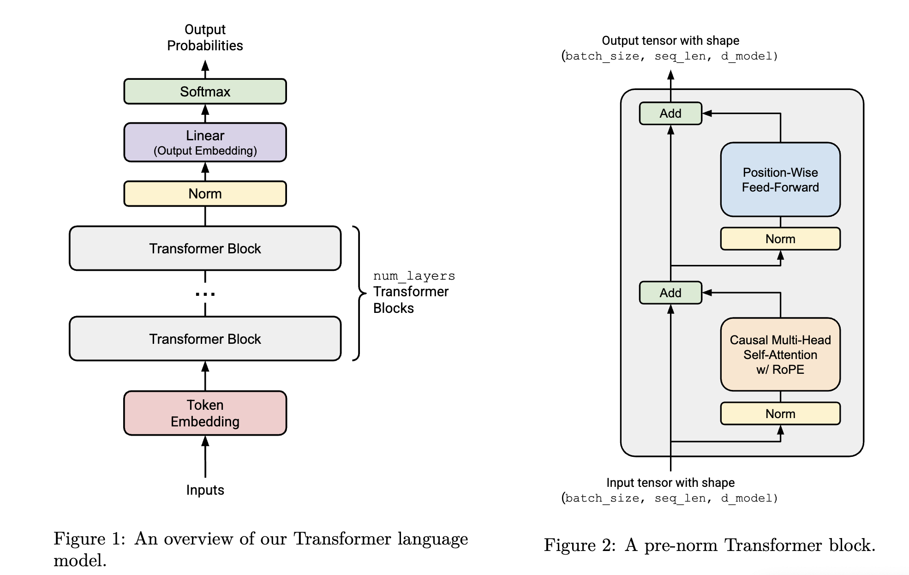

# Building LLM from Scratch

A complete implementation of a Large Language Model (LLM) built entirely from scratch using PyTorch. This project demonstrates the fundamental components of modern transformer-based language models, including a custom BPE tokenizer, transformer architecture, and **pretraining pipeline**. The model is designed for **pretraining on large text corpora** to learn general language representations, which can later be fine-tuned for specific downstream tasks.

## 🏗️ Project Overview

This project implements a transformer-based language model with the following key features:

- **Custom BPE Tokenizer**: Built from scratch with streaming support for large files
- **Transformer Architecture**: Complete implementation of the transformer architecture
- **Modern Training Techniques**: RMSNorm, RoPE positional encoding, SwiGLU activation
- **Memory-Efficient Training**: Streaming data processing and memory-mapped datasets

## 📁 Project Structure

```
building_llm/
├── LLM/                          # Core model components
│   ├── LM.py                    # Main language model class
│   ├── TransformerBlock.py      # Transformer block implementation
│   ├── MultiHeadSelfAttenion.py # Multi-head attention mechanism
│   ├── ScaledDotProductAttention.py # Scaled dot-product attention
│   ├── RoPE.py                  # Rotary positional encoding
│   ├── SwiGLU.py                # SwiGLU activation function
│   ├── RMSNorm.py               # RMS normalization
│   ├── Linear.py                # Linear layer implementation
│   ├── Embedding.py             # Embedding layer
│   └── utils.py                 # Utility functions
├── Tokenizer/                   # BPE tokenizer implementation
│   └── BPE.py                   # Byte-pair encoding tokenizer
├── data/                        # Dataset handling
│   └── LMDataset.py            # PyTorch dataset for language modeling
├── main.py                      # Main training script
├── pyproject.toml              # Project dependencies
└── README.md                   # This file
```

## 🧠 Model Architecture



### Usage

```python
# Initialize tokenizer
tokenizer = BPETokenizer(
    vocab_size=260,
    merges={},
    special_tokens={"<UNK>": 259, "<|endoftext|>": 258},
    file_path="training_data.txt"
)

# Train on your data
tokenizer.train_tokenizer()

# Save and load
tokenizer.save("my_tokenizer")
loaded_tokenizer = BPETokenizer.load("my_tokenizer")

# Encode/decode text
tokens = tokenizer.encode("Hello, world!")
text = tokenizer.decode(tokens)
```

## 🚀 Pretraining Pipeline

### Features

- **Epoch-based Pretraining**: Configurable number of epochs for language modeling
- **Learning Rate Scheduling**: Cosine annealing with warmup for stable pretraining
- **Validation**: Per-epoch validation with perplexity calculation
- **Checkpointing**: Automatic model saving with configurable frequency
- **Device Support**: Automatic GPU/MPS detection and usage
- **Language Modeling Objective**: Trains on next-token prediction task

### Training Configuration

```python
# Model hyperparameters
vocab_size = 5000
context_length = 128
d_model = 512
num_layers = 4
num_heads = 8
d_ff = 2048

# Training hyperparameters
num_epochs = 4
batch_size = 64
block_size = 1024
max_lr = 5e-4
min_lr = 1e-5
warmup_steps = 1000
cosine_annealing_steps = 3000
```

### Usage

```bash
# Pretrain the model
uv run main.py

# The script will:
# 1. Load or train the BPE tokenizer
# 2. Pre-tokenize the training data
# 3. Pretrain the language model on next-token prediction
# 4. Save checkpoints and final pretrained model
```


## 🛠️ Installation

### Prerequisites

- Python 3.8+
- PyTorch
- NumPy
- tqdm
- einops
- regex

### Setup

```bash
# Clone the repository
git clone <repository-url>
cd building_llm

# Install dependencies
pip install -r requirements.txt

# Or use uv (recommended)
uv sync
```

## 📊 Pretraining Data

The model is designed for **pretraining on large text corpora** to learn general language representations. Example data sources:

- **TinyStories**: Small stories for testing and development
- **Custom Corpora**: Your own text data for domain-specific pretraining
- **Large Files**: The tokenizer supports streaming for files of any size
- **Web Text**: General web text for broad language understanding

### Data Format

- Plain text files (.txt)
- UTF-8 encoding

## 🔧 Customization

### Model Architecture

Modify the model parameters in `main.py`:

```python
# Adjust model size
d_model = 768        # Larger embeddings
num_layers = 12      # More transformer blocks
num_heads = 12       # More attention heads
d_ff = 3072         # Larger feed-forward layers
```

### Pretraining Parameters

```python
# Adjust pretraining behavior
num_epochs = 10      # More pretraining epochs
batch_size = 128     # Larger batch size
context_length = 256 # Longer sequences for better context
```

## 📈 Monitoring Pretraining

The pretraining script provides comprehensive logging:

- **Pretraining Loss**: Per-batch and per-epoch language modeling loss
- **Validation Loss**: Per-epoch validation metrics
- **Perplexity**: Validation perplexity calculation (lower is better)
- **Learning Rate**: Current learning rate during pretraining
- **Progress Bars**: Real-time pretraining progress

## 💾 Model Persistence

### Checkpoints

- **Automatic Saving**: Models saved every N epochs (configurable)
- **Checkpoint Contents**: Model state, optimizer state, epoch, loss

### Final Model

- **Complete State**: Full pretrained model weights saved after training
- **Foundation Model**: Ready for fine-tuning on specific downstream tasks
- **Text Generation**: Can be used for basic text generation and evaluation

## 🎯 Text Generation & Evaluation

After pretraining, you can evaluate the model's language modeling capabilities:

```python
# Load pretrained model
model.load_state_dict(torch.load("final_model.pt"))
model.eval()

# Generate text to evaluate pretraining quality
start_phrase = "Once upon a time"
generated_text = utils.generate_text(model, tokenizer, start_phrase)
print(generated_text)

# Note: This is a pretrained model, not fine-tuned for specific tasks
# For production use, consider fine-tuning on your specific domain
```

## 🧪 Testing

The project includes comprehensive tests for all components:

```bash
# Run tests
python -m pytest tests/

# Run specific test categories
python -m pytest tests/test_model.py
python -m pytest tests/test_tokenizer.py
```

## 🔍 Key Implementation Details

### Attention Mechanism

- **Causal Masking**: Prevents looking at future tokens
- **Scaled Dot-Product**: Standard attention computation
- **Multi-Head**: Parallel attention across multiple heads

### Positional Encoding

- **RoPE (Rotary Position Embedding)**: Modern positional encoding
- **Pre-computed**: Efficient caching of sin/cos values
- **Configurable**: Adjustable frequency base (theta)

### Normalization

- **RMSNorm**: Root Mean Square normalization
- **Pre-norm**: Applied before attention and feed-forward
- **Stable Training**: Better gradient flow than LayerNorm

### Activation Functions

- **SwiGLU**: Swish-Gated Linear Unit
- **Modern Alternative**: Replaces ReLU in feed-forward networks
- **Better Performance**: Often outperforms traditional activations

## 🚀 Performance Optimizations

- **Memory Mapping**: Efficient handling of large pretraining datasets
- **Streaming Processing**: Tokenizer handles files of any size
- **Batch Processing**: Efficient GPU utilization for large-scale pretraining
- **Checkpointing**: Resume pretraining from any point
- **Scalable Architecture**: Designed to handle increasing model sizes and data

## 🤝 Contributing

This project is built for educational purposes and demonstrates:

- **Clean Architecture**: Modular, maintainable code structure
- **Best Practices**: Modern PyTorch patterns and conventions
- **Documentation**: Comprehensive code comments and documentation
- **Testing**: Thorough test coverage for all components

## 📚 Learning Resources

This implementation demonstrates concepts from:

- **"Attention Is All You Need"**: Original transformer paper
- **"RoFormer"**: Rotary positional encoding
- **"PaLM"**: SwiGLU activation functions
- **"GPT-2"**: Architecture and pretraining patterns

## 📄 License

This project is open source and available under the MIT License.

## 🙏 Acknowledgments

Built as part of the Stanfords CS336 course on building large language models from scratch. This project demonstrates the fundamental principles behind modern language models and provides a solid foundation for understanding transformer architectures. The pretraining approach follows the standard paradigm used in modern LLMs, where models are first pretrained on large amounts of text data to learn general language representations, then fine-tuned for specific tasks.

---
